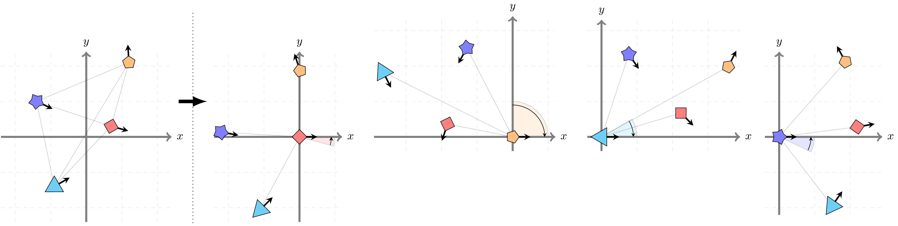

# Roto-translated Local Coordinate Frames for Interacting Dynamical Systems

Official source code for
<pre>
<b>Roto-translated Local Coordinate Frames for Interacting Dynamical Systems</b>
<a href="https://mkofinas.github.io/">Miltiadis Kofinas</a>, <a href="https://menaveenshankar.github.io/">Naveen Shankar Nagaraja</a>, <a href="https://egavves.com/">Efstratios Gavves</a>
<em>NeurIPS 2021</em>
<a href="https://arxiv.org/abs/2110.14961">https://arxiv.org/abs/2110.14961</a>
</pre>



[](https://arxiv.org/abs/2110.14961)
[](https://doi.org/10.5281/zenodo.7500066)

__Local frames construction demo:__
[](demo_local_frames_construction.ipynb)
[](https://colab.research.google.com/github/mkofinas/locs/blob/main/demo_local_frames_construction.ipynb)

__LoCS GNN demo:__
[](demo.ipynb)
[](https://colab.research.google.com/github/mkofinas/locs/blob/main/demo.ipynb)

### TL;DR

We propose local coordinate frames for all objects in the <em>geometric
graph</em> of an interacting dynamical system. Each local coordinate frame is
centered at the position of the target object and rotated such that it matches
the object's orientation. Our method, termed **LoCS** (**Lo**cal **C**oordinate
Frame**S**), can be added to any **graph network** that takes as inputs nodes
<em>positioned in space</em>, and <em>evolving through time</em>.

## Install

#### Option #1

The source code is written in Pytorch and uses PyTorch Geometric.

Create a Conda environment using `environment.yml`.

```sh
conda env create -f environment.yml
```
Then, install the project by running:

```sh
pip install -e .
```

#### Option #2

Alternatively, you can use the `install.sh` script to install the environment.

```sh
./install.sh
```

The script installs all dependencies one by one. Please mind that the script
might install different versions of some secondary dependencies.

#### Attribution

This codebase is based on the code from the papers:
- [__Neural Relational Inference for Interacting Systems__](https://arxiv.org/pdf/1802.04687.pdf), https://github.com/ethanfetaya/NRI
- [__Dynamic Neural Relational Inference__](https://openaccess.thecvf.com/content_CVPR_2020/papers/Graber_Dynamic_Neural_Relational_Inference_CVPR_2020_paper.pdf), https://github.com/cgraber/cvpr_dNRI

## Datasets

- __Synth__: this code includes the synthetic data, as well as code used to generate it.
- __Motion Capture__: the datasets can be downloaded from http://mocap.cs.cmu.edu/search.php?subjectnumber=35. For subject 35, you need trials 1-16 and 28-34.
- __InD__: Data must be requested from here: https://www.ind-dataset.com/
- __Charged Particles__: The dataset can be downloaded from https://doi.org/10.5281/zenodo.7500066. Eventually, the source code
  to generate the data will be added to the repository.

## Experiments

Scripts train models can be found in the `scripts` directory. For all datasets,
the script names have the following structure: `run_{dataset}_{model}.sh`.

#### Synthetic Dataset

You can train and evaluate __LoCS__ in the synthetic dataset by running the
following command from the repository root directory:

```sh
./run_synth_locs.sh
```

Similarly, you can train and evaluate __NRI__, __dNRI__, and __EGNN__, by
changing the model name.

#### Charged Particles

You can train and evaluate __LoCS__ in the charged particles dataset by running the
following command from the repository root directory:

```sh
./run_charged_locs.sh
```

Similarly, you can train and evaluate __NRI__, __dNRI__, and __EGNN__, by
changing the model name.

#### Motion #35

You can train and evaluate __LoCS__ in the motion capture dataset by running the
following command from the repository root directory:

```sh
./run_motion_35_locs.sh
```

Similarly, you can train and evaluate __NRI__, __dNRI__, and __EGNN__, by
changing the model name.

### inD

You can train and evaluate __LoCS__ in inD by running the
following command from the repository root directory:

```sh
./run_ind_locs.sh
```

Similarly, you can train and evaluate __GRU__, __dNRI__, and __EGNN__, by
changing the model name.

## Cite

If you use this code or this model in your work, please cite our work:

```bibtex
@inproceedings{kofinas2021roto,
  title={Roto-translated Local Coordinate Frames For Interacting Dynamical Systems},
  author={Kofinas, Miltiadis and Nagaraja, Naveen Shankar and Gavves, Efstratios},
  booktitle={Thirty-Fifth Conference on Neural Information Processing Systems (NeurIPS)},
  year={2021}
}
```
